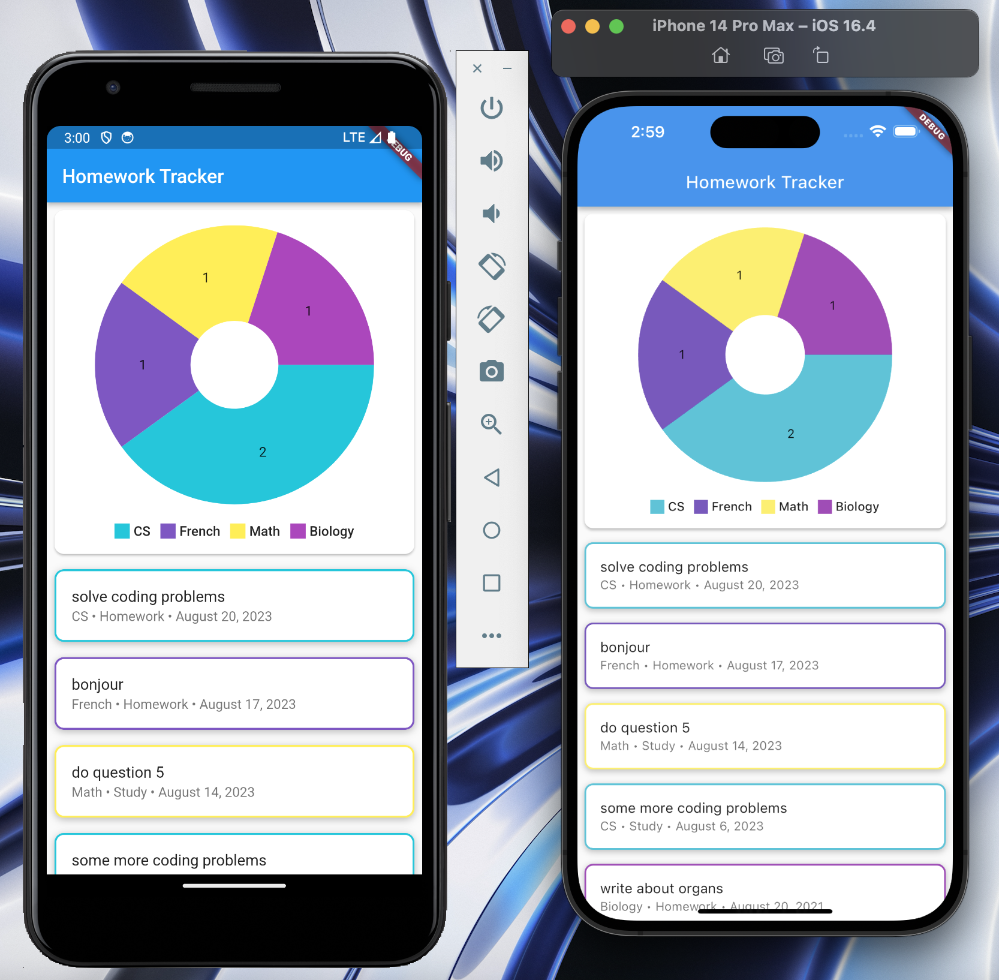

# Using Notion API with Flutter

A project I made for fun some time ago to play with the Notion API and experimenting its use cases with Flutter. I installed this app on my phone and used it because I thought it was cool, and I also wanted something minimal... unlike the notion app full of features I didn't need. Works on both Android and iOS. Inspiration: [Marcus Ng](https://www.youtube.com/@MarcusNg)

## Setup

Install [fvm](https://fvm.app/docs/getting_started/installation) and then through fvm, install Flutter SDK 2.2.2.

NOTE: After installing fvm and installing Flutter SDK 2.2.2, use `fvm flutter run` to run the app instead of the default command

Then, to use this app, setup two variables called `NOTION_API_KEY` and `NOTION_DATABASE_ID` in a .env file in the base directory. Also, while sharing this project, don't share these variables to the person you're sharing this project to, as this is vital information not meant to be shared.

## Cool features

- Reload (pull down)
- Pie chart
- Using Notion API

## Images of my app

